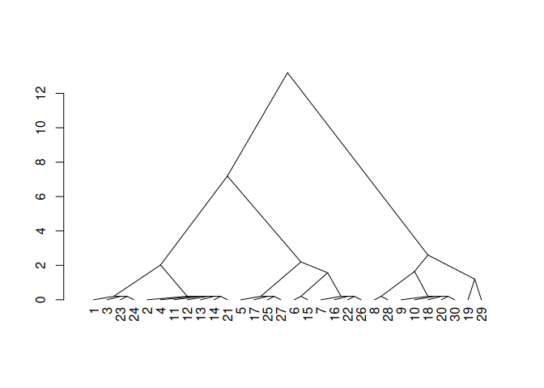
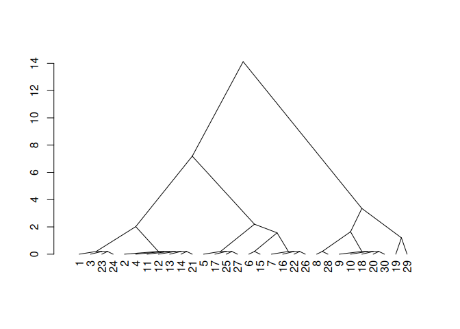

<!-- README.md is generated from README.Rmd. Please edit that file -->

# SOILmilaR

<!-- badges: start -->

[](https://github.com/brownag/SOILmilaR/actions/workflows/R-CMD-check.yaml)
<!-- badges: end -->

The goal of {SOILmilaR} is to provide methods for applying standardized,
customizable “similar soils” rules to site-level data derived from
various sources.

The core function to implement this method is `similar_soils()`, which
compares a set of soils against one soil type or combination of soil
conditions. `similar_soils()` can be called iteratively using the
`design_mapunit()` function.

The method generally follows the process outlined in Norfleet &
Eppinette (1993):

> Norfleet, M.L. and Eppinette, R.T. (1993), A Mathematical Model for
> Determining Similar and Contrasting Inclusions for Map Unit
> Descriptons. Soil Survey Horizons, 34: 4-5.
> <https://doi.org/10.2136/sh1993.1.0004>

## Installation

You can install the development version of SOILmilaR from
[GitHub](https://github.com/) with:

``` r
# install.packages("remotes")
remotes::install_github("brownag/SOILmilaR")
```

## Example

This is an example that shows you how `similar_soils()` works.

First we generate a synthetic data set using random soil depths across a
range of depth classes, as well as random particle size control section
clay content and fragments.

Then we apply a subset of taxonomic rules for loamy soils to assign a
taxonomic particle size class.

``` r
library(SOILmilaR)

set.seed(123)
x <- do.call('rbind', lapply(1:3, \(i) data.frame(id = paste0(LETTERS[1:10], i), 
                                                  depth = runif(10, 35, 150), 
                                                  pscs_clay = c(runif(4, 18, 35), runif(6, 14, 18)), 
                                                  pscs_frags = c(runif(3, 0, 15), runif(4, 10, 34), runif(3, 35, 60) + c(0, 40, 0)))))
x$taxpartsize <- interaction(cut(x$pscs_clay, c(0, 18, 35, 60, 100)),
                             cut(x$pscs_frags, c(0, 35, 90, 100)), drop = TRUE)
x$taxpartsize <- match(as.character(x$taxpartsize), c("(0,18].(0,35]", "(18,35].(0,35]", "(0,18].(35,90]", "(18,35].(35,90]"))
x$taxpartsize <- c("coarse-loamy", "fine-loamy", "loamy-skeletal", "loamy-skeletal")[x$taxpartsize]
x$taxpartsize[x$depth <= 50] <- "loamy"
x$taxpartsize[x$pscs_frags > 90] <- "fragmental"
```

Then we create some rating functions for properties of interest.

``` r
rate_taxpartsize <- function(x) {
  dplyr::case_match(x, 
                    c("sandy-skeletal") ~ 1,
                    c("sandy") ~ 3,
                    c("loamy", "coarse-loamy", "coarse-silty") ~ 5,
                    c("fine-loamy", "fine-silty") ~ 7,
                    c("clayey", "fine") ~ 9,
                    c("very-fine") ~ 11,
                    c("loamy-skeletal", "clayey-skeletal") ~ 13,
                    "fragmental" ~ 15)
}

rate_depthclass <- function(x,
                            breaks = c(
                              `very shallow` = 25,
                              `shallow` = 50,
                              `moderately deep` = 100,
                              `deep` = 150,
                              `very deep` = 1e4
                            ),
                            ...) {
  res <- cut(x, c(0, breaks))
  factor(res, levels = levels(res), labels = names(breaks), ordered = TRUE)
}

rate_pscs_clay <- function(x, breaks = c(18, 35, 60, 100)) {
  res <- cut(x, c(0, breaks))
  factor(res, levels = levels(res), ordered = TRUE)
}
```

To run `similar_soils()`, we pass a *data.frame* or
*SoilProfileCollection* as the first argument. The second argument is a
named list that provides a mapping between site-level properties and
rating functions. The list elements are functions with minimum arguments
`x` and `...`, and the element names are the corresponding columns.

``` r
m <- list(taxpartsize = rate_taxpartsize,
          depth = rate_depthclass,
          pscs_clay = rate_pscs_clay)

s <- similar_soils(x, m)
#> comparing to dominant reference condition (`7.deep.(18,35]` on 7 rows)
```

Here we inspect the tabular output of a single run.

``` r
head(s)
#>   id taxpartsize           depth pscs_clay similar_dist similar_single
#> 1 A1           7 moderately deep   (18,35]            1              1
#> 2 B1           7            deep   (18,35]            0              0
#> 3 C1           7 moderately deep   (18,35]            1              1
#> 4 D1           7            deep   (18,35]            0              0
#> 5 E1           5            deep    (0,18]            3              2
#> 6 F1           5         shallow    (0,18]            5              2
#>                       group similar
#> 1 7.moderately deep.(18,35]    TRUE
#> 2            7.deep.(18,35]    TRUE
#> 3 7.moderately deep.(18,35]    TRUE
#> 4            7.deep.(18,35]    TRUE
#> 5             5.deep.(0,18]   FALSE
#> 6          5.shallow.(0,18]   FALSE
```

The rating values can be used as surrogates for the detailed properties
for calculating distance.

Here, we use `cluster::agnes()` to cluster similar sets of rating
values, and render a dendrogram.

``` r
# inspect distances using agglomerative clustering+dendrogram
d <- cluster::agnes(s[, 5, drop = FALSE], method = "gaverage")
d$height <- d$height + 0.2 # fudge factor for 0-distance
plot(stats::as.dendrogram(d), center = TRUE, type = "triangle")
```



If we set `absolute=FALSE` then the differences between soils can be
negative, which can help with processing ratings that are ordinal in
nature.

``` r
# allow relative contrast ratings to be negative
# (i.e. ordinal factors, concept of "limiting")
# absolute value is still used for "similar" threshold
s2 <- similar_soils(x, m, absolute = FALSE)
#> comparing to dominant reference condition (`7.deep.(18,35]` on 7 rows)

# inspect distances unsing agglomerative clustering+dendrogram
d2 <- cluster::agnes(s2[, 5, drop = FALSE], method = "gaverage")
d2$height <- d2$height + 0.2 # fudge factor for 0-distance

plot(stats::as.dendrogram(d2), center = TRUE, type = "triangle")
```



### `design_mapunit()` function

A higher-level wrapper function around `similar_soils()` is
`design_mapunit()`. It takes the same inputs as `similar_soils()` but it
processes the data iteratively until there are no data remaining to be
grouped.

Here we use the same input data.frame and rating function.

``` r
d <- design_mapunit(x, m)

d[order(d$component), ]
#>    id     depth pscs_clay pscs_frags    taxpartsize component
#> 1  A1  68.07141  34.26617 13.3430897     fine-loamy     Alpha
#> 2  B1 125.65509  25.70668 10.3920511     fine-loamy     Alpha
#> 3  C1  82.03235  29.51870  9.6076022     fine-loamy     Alpha
#> 4  D1 136.54700  27.73477 33.8624746     fine-loamy     Alpha
#> 11 A2 145.74779  20.42760  0.6874675     fine-loamy     Alpha
#> 12 B2 138.76439  25.04729  6.6330011     fine-loamy     Alpha
#> 13 C2 114.43111  25.03331 11.9838727     fine-loamy     Alpha
#> 14 D2 126.47875  24.27037 12.9255822     fine-loamy     Alpha
#> 21 A3 111.48825  30.82608  3.6542921     fine-loamy     Alpha
#> 23 C3  79.15651  30.07310  6.2647017     fine-loamy     Alpha
#> 24 D3  66.55412  18.01062 28.9167000     fine-loamy     Alpha
#> 8  H1 137.62819  14.16824 49.8535505 loamy-skeletal      Beta
#> 9  I1  98.41503  15.31168 82.2289934 loamy-skeletal      Beta
#> 10 J1  87.51069  17.81801 38.6778412 loamy-skeletal      Beta
#> 18 H2  59.88691  15.86385 53.8326966 loamy-skeletal      Beta
#> 20 J2  61.63697  17.43131 44.3615694 loamy-skeletal      Beta
#> 28 H3 128.42479  16.45108 57.3262779 loamy-skeletal      Beta
#> 30 J3  85.58064  14.44454 39.3763163 loamy-skeletal      Beta
#> 6  F1  40.23900  17.59930 27.0047312          loamy     Delta
#> 15 E2  37.83057  14.60978 23.4627516          loamy     Delta
#> 22 B3  45.90668  28.69676 10.0208338          loamy     Delta
#> 19 I2  71.59082  15.06389 97.3761340     fragmental   Epsilon
#> 29 I3 126.34937  15.40719 97.1617265     fragmental   Epsilon
#> 5  E1 143.15374  14.41170 25.7369392   coarse-loamy     Gamma
#> 7  G1  95.73213  14.98435 23.0575846   coarse-loamy     Gamma
#> 16 F2  89.94654  14.55522 14.9567534   coarse-loamy     Gamma
#> 17 G2 122.22285  14.93214 13.0607596   coarse-loamy     Gamma
#> 25 E3 128.68360  15.90127 12.4687515   coarse-loamy     Gamma
#> 26 F3  86.57938  14.88048 20.4374258   coarse-loamy     Gamma
#> 27 G3 128.15740  15.51927 33.6389675   coarse-loamy     Gamma

sort(prop.table(table(d$component)), decreasing = TRUE)
#> 
#>      Alpha       Beta      Gamma      Delta    Epsilon 
#> 0.36666667 0.23333333 0.23333333 0.10000000 0.06666667
```

If we assume that the collection observations in `x` are spatially
representative of the mapunit extent, it is reasonable to consider the
resulting proportions to be similar to the abundance represented with
component percentages.

A literal interpretation of this output would result in a map unit with
5 groups of similar soils, of which 4 could be major components. Alpha
appears to be dominant, Beta and Gamma are co-dominant in second place,
Delta and Epsilon are dissimilar, limiting, and very strongly
contrasting, with Epsilon as a minor component.

``` r
apply(d[2:4], 2, \(dd) {
  aggregate(dd, by = list(component = d$component), quantile)
})
#> $depth
#>   component      x.0%     x.25%     x.50%     x.75%    x.100%
#> 1     Alpha  66.55412  80.59443 114.43111 131.51288 145.74779
#> 2      Beta  59.88691  73.60880  87.51069 113.41991 137.62819
#> 3     Delta  37.83057  39.03479  40.23900  43.07284  45.90668
#> 4   Epsilon  71.59082  85.28045  98.97009 112.65973 126.34937
#> 5     Gamma  86.57938  92.83933 122.22285 128.42050 143.15374
#> 
#> $pscs_clay
#>   component     x.0%    x.25%    x.50%    x.75%   x.100%
#> 1     Alpha 18.01062 24.65184 25.70668 29.79590 34.26617
#> 2      Beta 14.16824 14.87811 15.86385 16.94120 17.81801
#> 3     Delta 14.60978 16.10454 17.59930 23.14803 28.69676
#> 4   Epsilon 15.06389 15.14972 15.23554 15.32137 15.40719
#> 5     Gamma 14.41170 14.71785 14.93214 15.25181 15.90127
#> 
#> $pscs_frags
#>   component       x.0%      x.25%      x.50%      x.75%     x.100%
#> 1     Alpha  0.6874675  6.4488514 10.3920511 13.1343360 33.8624746
#> 2      Beta 38.6778412 41.8689428 49.8535505 55.5794872 82.2289934
#> 3     Delta 10.0208338 16.7417927 23.4627516 25.2337414 27.0047312
#> 4   Epsilon 97.1617265 97.2153284 97.2689302 97.3225321 97.3761340
#> 5     Gamma 12.4687515 14.0087565 20.4374258 24.3972619 33.6389675
```

If we summarize the properties of the resulting groups, we have:

- Alpha: moderately deep to deep, loamy-skeletal
- Beta: deep to moderately deep, fine-loamy
- Gamma: deep to moderately deep, coarse-loamy
- Delta: shallow, loamy
- Epsilon: moderately deep to deep, fragmental

Depending on the context of where these soils occur within the mapunit,
one may opt to further combine (or perhaps split out) unique conditions
as the pertain to unique soil properties, landforms, and vegetation.
